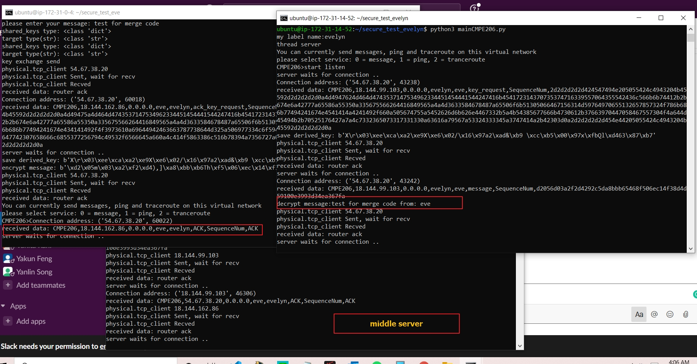

# Setup

## install requirement.txt under dir of the program root
```shell
curl -O https://bootstrap.pypa.io/get-pip.py
python3 get-pip.py
pip install -r requirement.txt
pip3 install pyyaml
pip3 install python-dateutil
```

Need to configure the network topology first.
- Start the VMs and get the ip addresses.
- Edit the /link/configure_of_connections.txt
    - Example of the configure_of_connection.txt 
        1. Topology: A<->B<->C
        2. Edit the file accordingly
            - A's IP = 00.00.00.00 
            - B's IP = 11.11.11.11
            - C's IP = 22.22.22.22

# Start the Program
1. upload the cmpe206 with different .routing file into each VM
2. run mainCMPE206.py
3. Enter your server name(Label)
4. Do step 3. for each VM
5. Choose one VM to do the following step.
6. Enter one of the commend
```shell
message
ping target(label)
traceroute target(label)
```

you should be able to see the result from the VM console.




# sjsu_cmpe_F20_206
Code base for SJSU CMPE 206 for Fall 2020

