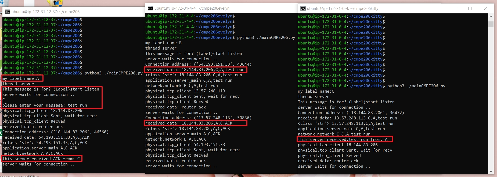

# Setup

## install requirement.txt under dir of the program root
```shell
pip install -r requirement.txt
```

Need to configure the network topology first.
- Start the VMs and get the ip addresses.
- Edit the /link/configure_of_connections.txt
    - Example of the configure_of_connection.txt 
        1. Topology: A<->B<->C
        2. Edit the file accordingly
            - A's IP = 00.00.00.00 
            - B's IP = 11.11.11.11
            - C's IP = 22.22.22.22


For A: **!!!remember to add a newline at the end of the file!!!**
-  A only connects to B, so to reach B or C needs to go to B. The IP for B,C is B's IP. This is datagram model.
```
B,11.11.11.11
C,11.11.11.11

```
For B: **!!!remember to add a newline at the end of the file!!!**
-  B connects to A and B, IP for A is A's IP. IP for C is C's IP.
```
A,00.00.00.00
C,22.22.22.22

```
For C:**!!!remember to add a newline at the end of the file!!!**
-  same as A, C only connects to B. Need to go to B for A, B. Both IP will be B's IP.
```
A,11.11.11.11
B,11.11.11.11

```

# Start the Program
1. upload the cmpe206 with different .txt file into each VM
2. run mainCMPE206.py
3. Enter your server name(Label)
4. Do step 3. for each VM
5. Choose one VM to do the following step.
6. Enter to which server(Label)
7. Enter your message
8. press Enter.

you should be able to see the result from the VM console.




# sjsu_cmpe_F20_206
Code base for SJSU CMPE 206 for Fall 2020

## install yaml
curl -O https://bootstrap.pypa.io/get-pip.py  <br />
python3 get-pip.py  <br />
pip3 install pyyaml  <br />

## using the command line interface
To send messages type "send message" <br/>
