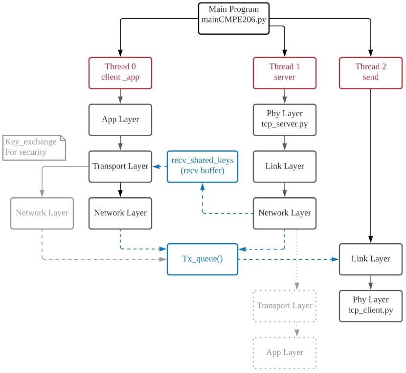

# Network over network
Deploy network architecture to route secure message between multiple VMs.<br />
Topology can be customized through routing table of the program.

## Introduction
1. Program architecture deploy on each node (instance)


2. File association of the program


3. Sequence diagram of secure messaging


4. Header layout


## Setup

### install requirement.txt under dir of the program root
```shell
sudo apt-get -y install python3-pip
pip install -r requirement.txt
pip3 install pyyaml
pip3 install python-dateutil
```

Need to configure the network topology first.
- Start the VMs and get the ip addresses.
- Edit the /link/connection_config.yaml
    - Example of the connection_config.yaml
        1. Topology: A<->B<->C
        2. Edit the file accordingly for Node A:
            - left: None
            - right: B's IP address

# Start the Program
1. upload the cmpe206 with different .routing file into each VM
2. run mainCMPE206.py
3. Enter your server name(Label)
4. Do step 3. for each VM
5. Choose one VM to do the following step.
6. Enter one of the commend
```shell
message
ping target(label)
traceroute target(label)
```

you should be able to see the result from the VM console.


# SJSU_FA20_CMPE_206
Codebase for SJSU CMPE 206 Fall 2020 class project.<br />
The codebase and program framework is designed by Evelyn Weng<br />
Feature contributor
- Secure Messaging : Evelyn Weng 
- Traceroute : Arturo Montoya
- Ping : Prathyusha Lingamallu

